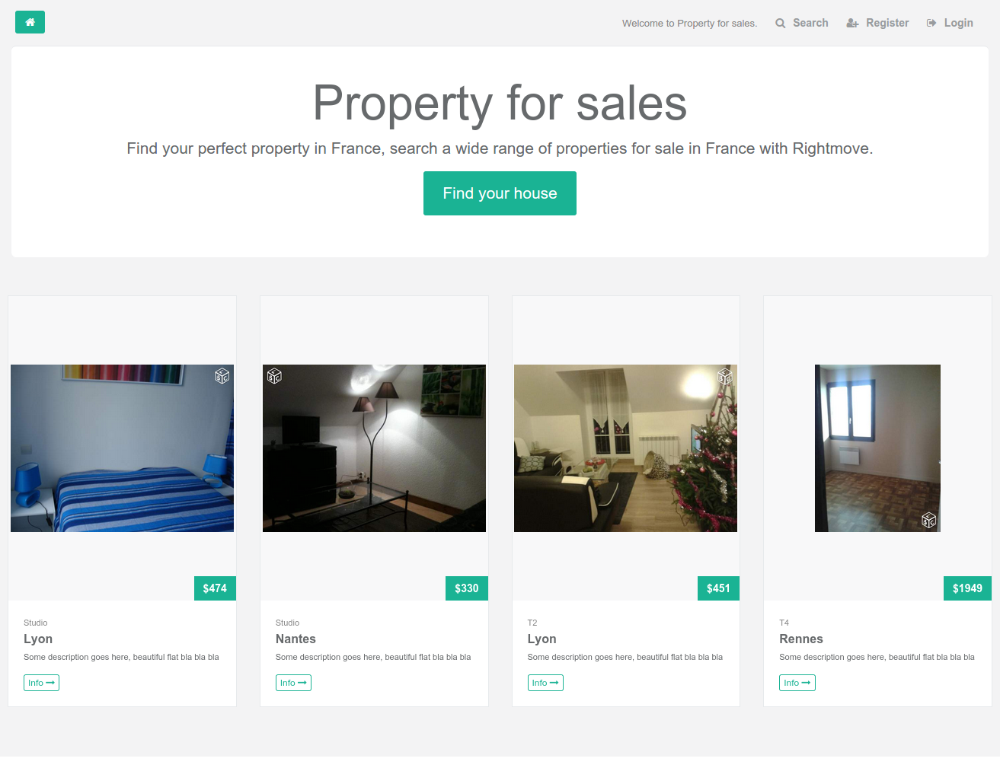

# Developers

Mohamed Labouardy
Yazid Hassaine 

# Demo

<table class="tg">
	<tr>
		<td>Client</td>
		<td>http://51.254.132.239:9000/#/</td>
	</tr>
	<tr>
		<td>Server</td>
		<td>http://51.254.132.239:8081/property-for-sales</td>
	</tr>
	<tr>
		<td>Cloud</td>
		<td>http://51.254.132.239:3000/</td>
	</tr>
	<tr>
		<td>Database MySQL</td>
		<td>http://51.254.132.239:3306</td>
	</tr>
</table>

# Property-for-sales
	
	- Server: EJB/Spring Security/Spring MVC/Mockito/Hiberante/MySQL
	- Client: AngularJS/HTML5/JavaScript/CSS/Bootstrap
	- Cloud: NodeJS/ExpressJS/Multr
	- Deploy: Docker

# Screenshot

# Public:
	- /adverts -> GET -> List of adverts 
	- /user/create -> POST -> Register
	- /adverts/{id} -> GET -> Advert detail 
	- /user/{id}/adverts -> GET ->user adverts 

# Private:
	- /api/user/adverts -> get -> user adverts 
	- /api/user/adverts/{id}/delete -> GET -> delete advert
	- /api/user/{id}/adverts/{id}/delete -> GET delete user advert  
	- /api/adverts/create -> POST -> create advert 
	- /api/login -> GET -> Login
	- /api/users -> GET -> list of users
	- /api/profile -> get > GET PROFILE
	- /api/profile/update -> post -> update profile
	- /api/user/{id}/delete -> GET -> delete user 
	- /api/profile/pîcture/delete -> POST -> update profile picture  
	- /api/criteria/update -> POST -> update search criteria
	-  /api/criteria -> GET -> get user criteria
